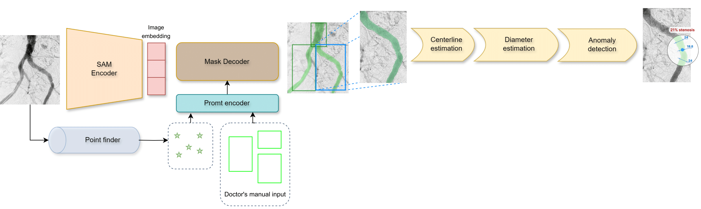

# Segment Anything

[Vazgen Zohranyan](https://www.linkedin.com/in/vazgenzohranyan/), [Vagner Navasardyan](https://www.linkedin.com/in/vagner-navasardyan-94b89229a/), [Hayk Navasardyan](https://www.linkedin.com/in/hayk-navasardyan-104024211/), [Jan Borggrefe](https://www.linkedin.com/in/univ-prof-dr-med-jan-borggrefe-a51654161/), [Shant Navasardyan](https://www.linkedin.com/in/shant-navasardyan-1302aa149/)


[[`Paper`](# WillBeAdded)] [[`Dataset`](https://drive.google.com/file/d/1o6igdM3PrEuVLSMEjece_jH3OhVNnoPg/view?usp=sharing)] 



The **Dr. SAM** is a comprehensive multi-stage framework for vessel segmentation, diameter
estimation, and anomaly analysis aiming to examine the peripheral vessels through
angiography images. It was validated on the new benchmark dataset consisting of 500 X-ray angiography images with 1,500 vessel segments. 
The [dataset](https://drive.google.com/file/d/1o6igdM3PrEuVLSMEjece_jH3OhVNnoPg/view?usp=sharing) was collected annotated by two expert radiologists. The dataset is publicly available and can be downloaded for research purposes.


## Setup

The code requires `python>=3.8`. 
1. Clone the code repository:
```bash
git clone git@github.com:vazgenzohranyan/Dr.SAM.git
```

1. For installing dependencies, run following command in your virtual environment.

```bash
pip install -r requirements.txt
```

2. Download and install the SAM model checkpoint. The model checkpoint can be downloaded from [here](https://dl.fbaipublicfiles.com/segment_anything/sam_vit_h_4b8939.pth).

3. Download [dataset](https://segment-anything.com/dataset/index.html) and extract it to `data` folder in the root of the project.

## Usage

To run the algorithm on the dataset, run the following command in your virtual environment after setting up the project.

```bash
python scripts/run.py --data data/
```

For the full list of arguments, run:

```bash
python scripts/run.py --help
```
or check the [source code](scripts/run.py).

## Dataset

Dataset consists of carefully selected images from 500 angiographic examinations of the pelvic-iliac arteries, carried out between 2018 and 2024 at Bad Oeynhausen Hospital and JWK Klinikum Minden, 
within their radiology departments. The focus of these examinations was the abdominal aorta below the renal arteries and the pelvic arteries. Of these images, 450 have a resolution of 386x448 pixels, and 50 have a resolution of 819x950 pixels. The dataset includes 170 images featuring at least one stenosis and 64 images with at least one aneurism.
The dataset archive is organized as follows:

- `images/`: Contains X-ray angiography images. Each image represents `{image_id}.jpg` 
- `masks/`: Contains binary masks. Each masks represents `{image_id}.png`.
- `metadata.json`: Contains information about the bounding boxes and the anomalies in the images.
- `README.md`: Contains information about the dataset.

`metadata.json`: This file contains information about bounding boxes and anomalies in the images. The file is structured as follows:

```json
{
  "image_id": 1, // Image id in the dataset
  "bboxes": [[x, y, width, height],
             [x, y, width, height], 
             [x, y, width, height]], // Bounding boxes of the vessels of interest
  "anomalies": {
    "stenosis": [(x, y)] // Coordinates of the stenosis, if no stenosis, the field is empty []
    "aneurism": [(x, y)] // Coordinates of the aneurism, if no aneurism, the field is empty []
  }
}
```


## License

The model is licensed under the [Apache 2.0 license](LICENSE).

## Citing Dr.SAM

If you use **Dr.SAM** in your research, please use the following BibTeX entry.

```
@article{kirillov2023segany,
  TODO
}
```